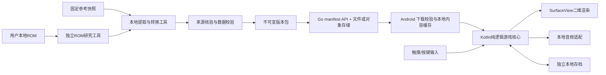

# Architecture

当前执行策略更新（2026-09-30）：用户授权检查点A的Android开发验证版，根目录AGENTS.md优先于下述历史阶段限制。研究未完成不再全局禁止开发；单项功能按证据启用。正式canonical、研究canonical-candidate继续阻断运行时，允许单独导出有版本/来源/范围的development包。APK内置包与后续下载目录实现同一读取接口；本轮不建Server。历史研究结果不变。

状态：Phase 0 设计决策，不是已实现系统。约束依据：[参考审计](reference-audit.md) 与 [数据清单](game-data-inventory.md)。目标是高还原度单机 RPG，内容发布与实时运行分离。

## 总体边界



服务器没有进入移动、碰撞、伤害、NPC、AI、随机遇敌或事件循环。Android运行时不访问ROM，不执行从服务端下载的任意脚本代码。

## Android与渲染决策

未来设备与UI需求以 [OnePlus 13T Android UI Requirements](android-ui-design.md) 为准：OnePlus 13T为主要真机参考，布局由运行时窗口、密度、安全区和刷新率驱动，不能按型号或屏幕像素硬编码。固定游戏逻辑画布、等比最近邻缩放、独立触控区域、可编辑控制布局和逻辑/显示刷新率解耦均为未来验收约束；本Phase只记录，不实现。

Phase 1数据准入继续阻断：ROM为Original Truth，Reference仅作索引/提示/比较/迁移来源；差异必须进入Difference Ledger。`canonical-candidate/`只允许研究候选，不属于Android/Server可消费的数据源。正式canonical和后续Phase仍由Vertical Slice证据门槛控制。

优先 Kotlin。核心规则放纯 Kotlin/JVM 模块，依赖标准类型和小型接口；Android包装生命周期、输入、绘图、音频和存储。无需为了这一平台先引入跨平台框架或ECS。

**首选 SurfaceView + Canvas 的专用2D渲染器**：本作以有限可见tile、sprite、窗口文字与回合战斗为主，Kotlin适配简单、引擎依赖少。地图按可见区域裁剪，tile图块预切/图集缓存，避免每帧解码或遍历整张图；像素画面先绘入固定逻辑缓冲再做最近邻整数缩放。该选择是工程判断，不是已经通过性能测试的事实。[Android SurfaceView 文档](https://developer.android.com/reference/android/view/SurfaceView)说明其独立绘制surface与生命周期机制。

Phase 2 在低端目标设备做基准后锁定。如果Canvas不满足预算，保持 RenderCommands/AssetProvider接口，替换成GLSurfaceView/OpenGL ES 2D sprite batch；不影响事件、战斗和存档。现在不引入Vulkan、Unity、网络游戏引擎或自制通用编辑器。

渲染契约：

- 横屏，暂定逻辑帧缓冲256×240作为研究基线；原版实际可见区域、裁边与文字窗口必须在ROM/录像对齐后确认。**不能沿用参考App的960×640作为FC原分辨率。**
- 逻辑格子与资源像素解耦。TMX80像素是导入单位，先保存sourceTileSize；是否转成16像素必须有像素证据，不能简单除5。
- 可用画布W×H中取 `s=floor(min(W/logicalW,H/logicalH))`，s≥1时整数等比放大居中；剩余空间放控制器或黑边。极小窗口s<1使用等比最近邻降采样并明确非整数像素模式，不拉伸地图。
- 输入反变换使用同一viewport；安全区/刘海/导航栏不挤压逻辑画面。D-pad、A/B、Start/Menu支持多指、按下/释放/重复，ACTION_CANCEL与失焦释放所有按键，避免卡方向。
- Surface创建/销毁与前后台显式启动/暂停；不在UI线程执行数据包校验。渲染只读帧快照，单线程核心写GameState，输入通过队列串行处理。
- 逻辑固定步长、模拟tick与呈现帧分离；原版节奏待取证。时钟/RNG可注入，后台暂停不按墙钟补几十秒移动。
- 地图层→实体→遮挡→游戏窗口顺序由渲染模型定义。文字使用已核实字体/字形，保留原版分页控制；不得用系统字体替代后宣称像素还原。

平台 UI 只用于启动/下载、设置、登录与存档管理；不把地图、对话、战斗拆成大量现代 UI 页面。早期“第一版无需登录”已由 2026-09-30 云端存档需求取代。

## 核心模块与状态

建议未来单仓结构如下，当前只创建docs和reference-audit工具，其他目录是计划：

```text
android/                 Android宿主、渲染、输入、音频
core/                    Kotlin/JVM纯逻辑：world/event/battle/save model
server/                  Go内容manifest与包服务
game-data/               schema、来源索引、经核验的内容编排
tools/reference-import/  SQLite/TMX/atlas转换
tools/rom-extractor/     本地ROM研究，不参与App运行或公开构建
tools/data-validator/    schema+跨引用+语义+路径验证
tools/map-viewer/        本地地图/碰撞/事件检查器
docs/                    决策、取证、差异与验收
```

`GameState`负责玩家位置、角色/队伍、背包/装备、余额、任务Flag、宝箱、Boss、NPC覆盖、地图tile变化、传送解锁、随机源、游戏tick。`ContentSnapshot`只读，按package hash绑定。内容定义不写回玩家状态；存档不复制所有地图/道具定义。

状态机至少有 Boot/ContentLoading/Title/Overworld/Dialogue/Event/Battle/Menu/Paused；命令验证可在当前状态执行后才变更。事件等待战斗结果、对话确认或动画完成必须有显式continuation，禁止在Android页面生命周期里悄悄改变剧情。

## Go服务端与发布

V1采用Go标准HTTP服务 + 本地文件或对象存储。无需PostgreSQL：当前只有版本目录和不可变内容包，没必要用数据库保存每个NPC。发布工具离线校验包后，将发布manifest一次性切换。对象存储/CDN只提供静态文件。

计划接口：

|接口|行为|
|---|---|
|GET /api/v1/game/manifest|返回当前稳定内容版本、最低客户端、schema与包信息；可带ETag|
|GET /packages/{contentHash}.zip|不可变字节内容；本地开发由Go提供，生产可换对象存储URL|
|GET /healthz|进程存活，不依赖数据库|
|POST/GET /api/v1/save|仅预留将来协议边界，V1不实现、不自动上传|

manifest形状示例（仅协议占位，不是真实发布）：

```json
{
  "gameDataVersion": "0.1.0",
  "minClientVersion": "0.1.0",
  "schemaVersion": 1,
  "requiredCapabilities": ["event-v1"],
  "packageUrl": "https://example.invalid/packages/CONTENT_HASH.zip",
  "sha256": "<64 lowercase hex characters>",
  "packageSize": 123456
}
```

真实发布不能使用占位hash。`gameDataVersion`是展示版本，hash锁定内容；schemaVersion是数据结构，clientVersion是程序，saveSchemaVersion是存档，四者不能混用。minClientVersion按明确的版本比较规则处理，不能字符串字典序比较。

Phase 3交付多阶段Go Dockerfile、非root运行镜像、只读内容volume和docker-compose.yml；`docker compose up --build`即可获得health与manifest。**Phase 0不生成未测试的服务代码/Dockerfile。** 正式包发布只允许rights/provenance状态符合发布目标的文件，未经核实的素材不能因加入ZIP就被视为可分发。

## 内容包与原子更新

V1先用一个压缩包装JSON+资源，避免多个资源包间事务过早复杂化。`package.json`记录文件hash、字节数、schema、能力列表、内容profile、原版基准ID和来源索引；以后包过大再拆共享asset包，仍用一个root manifest锁定所有hash。

启动优先加载最后已验证的本地版本，同时请求远端manifest；无网络则直接继续。首次安装且没有包时需要一次下载或用户导入，不能声称空安装也能离线玩。

更新状态机：Discover → Compatible → Downloading → HashVerified → Unpacked → Validated → Ready → Activated。

1. 先检查客户端/schema/能力兼容；不兼容的新包不替换当前可用包，也不妨碍离线旧档。
2. 下载至临时文件，检查实际字节数、SHA-256。HTTPS/可信发布源保证来源；hash仅保证内容一致性，若未来支持第三方镜像，再增加签名与密钥轮换。
3. 解包到同卷全新目录，限制条目数/解压体积、拒绝目录穿越/重复规范化路径，不覆盖活动目录。
4. 校验package manifest与逐文件hash，JSON Schema、引用、必需资源、事件能力、存档迁移可用性全部通过才标记Ready。
5. 当前游玩会话一直锁定旧ContentSnapshot；在标题/退出游戏后的安全点切换。迁移在旧存档副本上运行，成功后写新generation并与新内容hash绑定。
6. 把小型active指针写临时文件、flush并同卷原子替换；保留previous指针和旧目录。应用崩溃后验证指针/包/存档配对，回退到上一个有效组合。
7. 任何下载、断电、磁盘不足、解包、验证、迁移失败都保持旧版本可运行；清理只删除未引用的临时包。被任一存档引用的旧版本保留，直到明确迁移或用户删除该档。

不能覆盖安装目录里的JSON后再写版本号；那会出现跨版本半更新。包发布不可原地修改同一version/hash URL的内容。

## Local First存档

每个槽位保存完整状态快照与`saveSchemaVersion/contentHash/gameDataVersion/rulesetId/baseGameId/revision/checksum`，包含游玩时长、RNG算法与状态。校验和用于发现损坏，不当防作弊签名。

使用单写入队列，在安全逻辑tick冻结不可变SaveSnapshot；`slot/generation.tmp`写入+flush后原子更名，再切active指针，保留最近有效上一代。加载先验证封装/校验和/引用/兼容，再构造GameState；损坏恢复不静默覆盖原文件。Android实际文件API、崩溃恢复和fsync边界在Phase 3做故障注入验证。

V1只在探索安全点手动/自动保存，战斗与事件执行期间延迟自动存档；最近checkpoint可重放，避免宝箱奖励给了却Flag没写。仍在状态模型保留event checkpoint/事务ID以扩展。玩家不能在进行中的跨帧sequence中途提交半个状态。

迁移函数由客户端随程序发布，按 `(fromSaveSchema,fromContentHash,to...)`显式转换。内容包可带受限的ID别名/迁移声明，但不带可任意执行的代码。未知或不兼容版本保留原档并使用旧内容，禁止“忽略未知Flag后继续”。

2026-09-30 用户已明确授权云端 PostgreSQL 个人存档，本段“现在不引入账号、鉴权和PostgreSQL”的旧限制失效。云同步仍是本地槽位的独立传输层：封神独立登录、服务端修订号 CAS、登录时取回、离线保留本地待同步；不按最后时间戳盲覆盖，不上传 ROM 或整个资源包。当前只持久化运行时已有状态和可追溯初始角色字段，未实现的物品/升级逻辑不得在云端伪造进度。

## 事件系统

事件用类型化条件树+动作序列，内容写数据、执行语义写纯Kotlin。完整字段见 [Data Schema](data-schema.md)。`switch_on/off`必须经显式转换词典生成命名Flag；不能自动按真/假翻译。

动作分为同步状态变更与异步等待：对话/动画/战斗/地图加载返回continuation；执行器保存指令位置与结果分支。每个事件有触发类型、优先级、重入策略、onceKey、条件与失败策略。动作预算/最大递归防内容死循环；异常报告eventId和源记录，停在安全检查点。

宝箱与商店是事务：检查空间/余额/条件→一次性修改背包+余额+开启标记→再发呈现效果。战斗结果必须分胜/败/逃跑，不让逃跑触发胜利剧情。异步Boss战完成后再写胜利Flag；不可先发奖励再等用户输入。

## ROM Extractor

独立Python工具，输入仅用户指定本地路径，默认只读；输出到Git忽略的private-derived，再经审计导入。没有用户ROM时只能写规格和合成fixture，不能声称找到真实偏移。

处理步骤：

1. 计算ROM hash、大小，检测iNES/NES2 header、trainer、PRG/CHR长度、mapper/submapper；不凭游戏名猜mapper。[iNES格式](https://www.nesdev.org/wiki/INES)、[NES 2.0格式](https://www.nesdev.org/wiki/NES_2.0)。
2. 为该hash建立版本profile，分开文件offset、CPU地址、PPU地址与bank编号。bank切换后同一CPU地址可指不同ROM内容。
3. CHR/PRG扫描候选tile、字库、指针表、压缩块；没有CHR-ROM时研究CHR-RAM上传来源。不能把NES文件当统一JSON或假定所有地图都在CHR。
4. 借本地模拟器调试轨迹捕获文本读取、地图解压、NPC加载、数值读写、6502战斗计算和APU寄存器写入。每个解码规则保留字节范围与运行证据。
5. 中文字库建字形→编码→Unicode映射；OCR仅生成待审候选，人工确认。对话保留控制码/分页，地图保留metatile/属性/碰撞而非只有截图。
6. 装备/怪物/经验/商店逐字段对照画面/内存；输出canonical数据、source map和UNKNOWN区段。剧情未必是表，也可能要还原代码控制流。
7. 音乐是驱动/序列/APU行为，不假定能直接导出MP3；可研究序列解码或本地模拟播放采样，NSF导出是否可行需个案确认。

构建App只接受已转换的内容包。CI仅用合成数据测试解析器；真实ROM测试本地显式启用，不缓存/上传到远程CI。

## 测试与Debug

核心通过命令→状态→事件轨迹做确定性测试，注入RNG/时钟/内容仓库；不依赖Android UI。覆盖地图加载/碰撞、解析、战斗公式、EXP、升级、装备、物品、技能、条件/Flag、宝箱/商店、保存恢复与内容升级。

data-validator区分结构错误、引用错误、未知语义与真实性未核；能查无效map/NPC/dialogue/enemy/item/event ID、重复ID、边界、schema、事件引用、剧情分支、不可达候选。静态可达图包含warp、剧情teleport和事件状态；条件不可满足性需要状态空间/轨迹验证，不能将简单BFS通过当通关。

Debug构建提供传送、等级/金钱/物品/Flag修改、强制战斗、map/坐标/Flag/版本展示和可导出轨迹；有修改时标记debug存档，避免混入忠实度验收。Release构建不注册调试入口。

验收分四层：解析完整性 → 核心确定性测试 → Android生命周期/输入/图像与性能 → 原版基准逐章比对与真实全流程通关。完整测试清单和阶段门槛见 [Implementation Plan](implementation-plan.md)。
